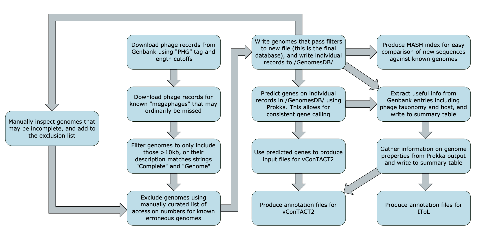
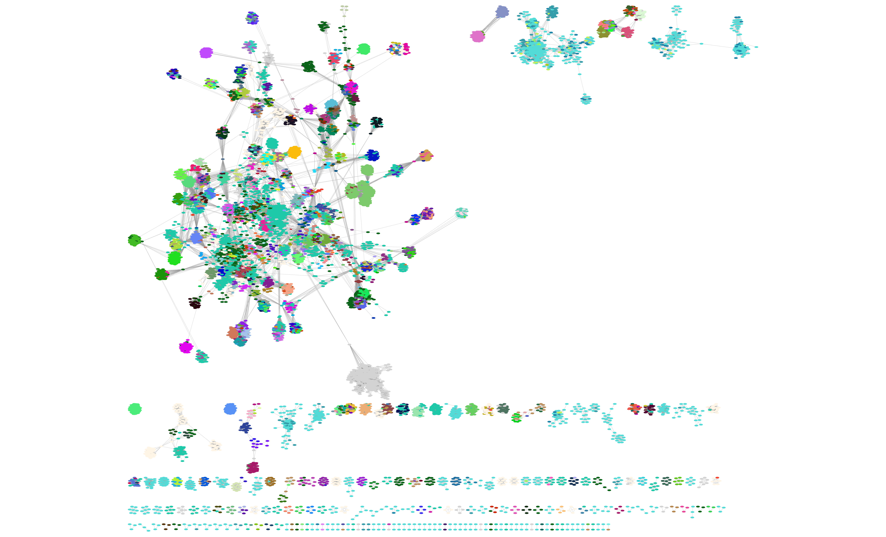
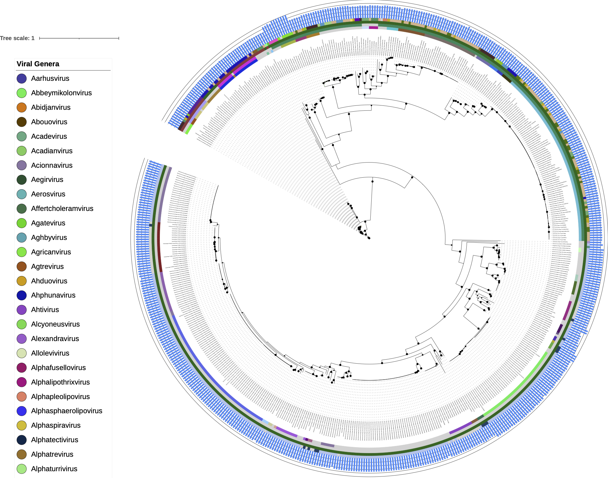

# inphared.pl

Providing up-to-date bacteriophage genome databases, metrics and useful input files for a number of bioinformatic pipelines including vConTACT2 and MASH. The aim is to produce a useful starting point for viral genomics and meta-omics.

## Citation:

If you find our database useful, please see our recently published paper in PHAGE [HERE](https://www.liebertpub.com/doi/full/10.1089/phage.2021.0007)

Cook R, Brown N, Redgwell T, Rihtman B, Barnes M, Clokie M, Stekel DJ, Hobman JL, Jones MA, Millard A. INfrastructure for a PHAge REference Database: Identification of Large-Scale Biases in the Current Collection of Cultured Phage Genomes. PHAGE. 2021. Available from: [http://doi.org/10.1089/phage.2021.0007](http://doi.org/10.1089/phage.2021.0007).

## Shortcuts:

* [Let me skip running the script and just give me this month's data!](#let-me-skip-running-the-script-and-just-give-me-this-months-data)
* [Description](#description)
* [Updates](#updates)
* [Dependencies](#dependencies)
* [Usage](#usage)
* [Output Files](#output-files)
* [Supplementing and Annotating vConTACT2 Clusters](#supplementing-and-annotating-vcontact2-clusters)
* [Annotating Phylogenetic Trees in IToL](#annotating-phylogenetic-trees-in-itol)
* [Rapid Genome Comparisons using MASH](#rapid-genome-comparisons-using-mash)
* [get_closest_relatives.pl](#get_closest_relatives)
* [Contact](#contact)

## Let me skip running the script and just give me this month's data!

- [14Apr2025_data_excluding_refseq.tsv](https://millardlab-inphared.s3.climb.ac.uk/14Apr2025_data_excluding_refseq.tsv.gz)
- [14Apr2025_data.tsv](https://millardlab-inphared.s3.climb.ac.uk/14Apr2025_data.tsv.gz)
- [14Apr2025_genomes.db](https://millardlab-inphared.s3.climb.ac.uk/14Apr2025_genomes.db.gz)
- [14Apr2025_genomes_excluding_refseq.fa](https://millardlab-inphared.s3.climb.ac.uk/14Apr2025_genomes_excluding_refseq.fa.gz)
- [14Apr2025_genomes.fa](https://millardlab-inphared.s3.climb.ac.uk/14Apr2025_genomes.fa.gz)
- [14Apr2025_genomes.fa.msh](https://millardlab-inphared.s3.climb.ac.uk/14Apr2025_genomes.fa.msh.gz)
- [14Apr2025_itol_family_annotations.txt](https://millardlab-inphared.s3.climb.ac.uk/14Apr2025_itol_family_annotations.txt.gz)
- [14Apr2025_itol_genus_annotations.txt](https://millardlab-inphared.s3.climb.ac.uk/14Apr2025_itol_genus_annotations.txt.gz)
- [14Apr2025_itol_host_annotations.txt](https://millardlab-inphared.s3.climb.ac.uk/14Apr2025_itol_host_annotations.txt.gz)
- [14Apr2025_itol_length_annotations.txt](https://millardlab-inphared.s3.climb.ac.uk/14Apr2025_itol_length_annotations.txt.gz)
- [14Apr2025_itol_lowest_taxa_annotations.txt](https://millardlab-inphared.s3.climb.ac.uk/14Apr2025_itol_lowest_taxa_annotations.txt.gz)
- [14Apr2025_itol_node_label_annotations.txt](https://millardlab-inphared.s3.climb.ac.uk/14Apr2025_itol_node_label_annotations.txt.gz)
- [14Apr2025_itol_subfamily_annotations.txt](https://millardlab-inphared.s3.climb.ac.uk/14Apr2025_itol_subfamily_annotations.txt.gz)
- [14Apr2025_phages_downloaded_from_genbank.gb](https://millardlab-inphared.s3.climb.ac.uk/14Apr2025_phages_downloaded_from_genbank.gb.gz)
- [14Apr2025_refseq_genomes.fa](https://millardlab-inphared.s3.climb.ac.uk/14Apr2025_refseq_genomes.fa.gz)
- [14Apr2025_vConTACT2_family_annotations.tsv](https://millardlab-inphared.s3.climb.ac.uk/14Apr2025_vConTACT2_family_annotations.tsv.gz)
- [14Apr2025_vConTACT2_gene_to_genome.csv](https://millardlab-inphared.s3.climb.ac.uk/14Apr2025_vConTACT2_gene_to_genome.csv.gz)
- [14Apr2025_vConTACT2_genus_annotations.tsv](https://millardlab-inphared.s3.climb.ac.uk/14Apr2025_vConTACT2_genus_annotations.tsv.gz)
- [14Apr2025_vConTACT2_host_annotations.tsv](https://millardlab-inphared.s3.climb.ac.uk/14Apr2025_vConTACT2_host_annotations.tsv.gz)
- [14Apr2025_vConTACT2_lowest_taxa_annotations.tsv](https://millardlab-inphared.s3.climb.ac.uk/14Apr2025_vConTACT2_lowest_taxa_annotations.tsv.gz)
- [14Apr2025_vConTACT2_proteins.faa](https://millardlab-inphared.s3.climb.ac.uk/14Apr2025_vConTACT2_proteins.faa.gz)
- [14Apr2025_vConTACT2_subfamily_annotations.tsv](https://millardlab-inphared.s3.climb.ac.uk/14Apr2025_vConTACT2_subfamily_annotations.tsv.gz)
- [PHROGs HMMs for consistent annotation of genomes (see the new --PHROG optional flag)](https://warwick.s3.climb.ac.uk/ADM_share/all_phrogs.hmm.gz)
- [GenomesDB Directory](https://millardlab-inphared.s3.climb.ac.uk/GenomesDB12102022.tar.gz) (please note that this doesn't get updated each month, it's just here as a time-saver if you run the script yourself. This version is for 13/Dec/2021)

## Description

inphared.pl (**IN**frastructure for a **PHA**ge **RE**ference **D**atabase) is a perl script which downloads and filters phage genomes from Genbank to provide the most complete phage genome database possible.

Useful information, including viral taxonomy and bacterial host data, is extracted from the Genbank files and provided in a summary table. Genes are called on the genomes using Prokka and this output is used to gather metrics which are summarised in the output files, as well as useful input files for vConTACT2.

## Updates

**v1.7 (03-Mar-2022):**
- Added additional column to .tsv files which grabs any tags annotated as "host" or "lab_host", which is able to retrieve bacterial host for a number of genomes at the level of species. However, many of these values are inconsistent or not relating to the isolation host but to the environmental sample (e.g. wastewater).
- When searching for MASH, the script will now automatically search for mash or mash.2. Should make it easier to find MASH on most user's systems.

**v1.6 (02-Feb-2022):**
- Added lines to correct spelling of certain hosts in table output file (e.g. Klebsiella, where original Genbank record has Kelbsiella).

**v1.5 (15-Dec-2021):**
- Added an optional flag to annotate genomes with HMMs produced from the [PHROGs](https://academic.oup.com/nargab/article/3/3/lqab067/6342220) database. Download the HMMs for yourself [HERE](http://s3.climb.ac.uk/ADM_share/all_phrogs.hmm.gz). Read about what we did [HERE](http://millardlab.org/2021/12/15/inphared-re-annotated-with-phrogs/).

**v1.4 (11-Nov-2021):**
- tsv files now include expanded taxa fields including genus, sub-family, family, order, class, phylum, kingdom and realm.

**v1.3 (02-Aug-2021):**
- tsv files now include realm, Baltimore group, a warning flag for genomes with <50% coding capacity (may be issues with the assembly), and the Genbank designation (i.e. PHG, ENV)

**v1.2 (18-Feb-2021):**
- Output files now written to directory, name of which can be specified (see usage).
- List of excluded genomes now a separate file which can be edited and specified as a commandline argument (see usage).

**v1.1 (09-Feb-2021):**
- Improved host data, particularly for Cyanophages.
- Fixed issue with some Prokka versions outputting .gbf and others outputting .gbk, both will now be read by this script.

## Dependencies

inphared.pl is a Perl script which makes calls to commandline utilities which must be installed and available in the PATH for the script to run. If it doesn't find one of these, it will print which dependency could not be found.

- Prokka (available [HERE](https://github.com/tseemann/prokka))
- MASH (available [HERE](https://mash.readthedocs.io/en/latest/index.html))
- efetch, esearch and efilter (available together as part of Entrez Direct: E-utilities [HERE](https://www.ncbi.nlm.nih.gov/books/NBK179288/))

## Usage

Note before running for first time: Upon first usage, it will take a long time to call genes on all of the genomes. This time can be reduced by downloading the existing `GenomesDB/` directory from [HERE](http://inphared.s3.climb.ac.uk/GenomesDB_20201412.tar.gz). Download and unzip this tar archive in the directory you wish to run inphared.pl, so `GenomesDB` is a sub-directory of the desired working directory.

To run this script, use inphared.pl with the following command:

`perl inphared.pl [options]`

- `--exclusion <exclusion_list.txt>` (`-e`): This flag allows the user to specify the location of a pipe-delimited file of accessions to be excluded from the analysis. We provide the file `exclusion_list.txt` which is continually updated but can be edited by the user. We recommend using this flag. If you find any incomplete genomes, please report these in the [erroneous genomes](https://github.com/RyanCook94/inphared.pl/discussions/1) discussion page.
- `--cpus <8>` (`-c`): This flag allows users to specify the number of CPUs to be used in the Prokka step. This is a numeric argument and the default number is 8.
- `--outdir <directory>` (`-o`): This flag allows users to specify the name of the output directory. If it doesn't already exist, the script will produce it. The default is `inphared_date`.
- `--help` (`-h`): This flag will print a help menu to the screen without performing any analyses.
- `--PHROG` (`-P`): This optional flag allows users to specify the path to HMMs made from the PHROGs database, for consistent annotation of genomes (download the HMMs for yourself [HERE](https://s3.climb.ac.uk/ADM_share/all_phrogs.hmm.gz) and read about them [HERE](http://millardlab.org/2021/11/21/phage-annotation-with-phrogs/)). 

## Output Files

Output files will be written to a new directory named `inphared_date` unless a different name is specified. All output files will have the date of usage as a prefix. The summary of output files below uses 15th January 2021 as an example (although this prefix will obviously change).

| Output File                                     | Description                                                  |
| ----------------------------------------------- | ------------------------------------------------------------ |
| 15Jan2021_phages_downloaded_from_genbank.gb     | The raw Genbank files downloaded from NCBI. These are unfiltered and may contain poor or incomplete phage genomes. |
| GenomesDB/                                      | This directory contains individual sequence files for each of the filtered genomes, and sub-directories containing Prokka output. |
| 15Jan2021_genomes.fa                            | This fasta file contains the filtered phage genomes which are believed to be complete (or at least near-complete). |
| 15Jan2021_genomes_excluding_refseq.fa           | This fasta file contains the same genomes as above, with the RefSeq genomes removed. This avoids duplicated sequences, as RefSeq genomes are listed in Genbank with two separate accessions. |
| 15Jan2021_refseq_genomes.fa                     | This fasta file contains the filtered RefSeq complete phage genomes. |
| 15Jan2021_genomes.db                            | This database file is a fasta index of the 15Jan2021_genomes.fa file. It can be used for the convenient lookup of sequences. |
| 15Jan2021_data.tsv                              | This file of tab separated values contains useful data and metrics for the filtered phage genomes found in 15Jan2021_genomes.fa. |
| 15Jan2021_data_excluding_refseq.tsv             | This file of tab separated values contains useful data and metrics for the filtered phage genomes found in 15Jan2021_genomes_excluding_refseq.fa. |
| 15Jan2021.fa.msh                                | This MASH sketch database allows for easy comparison of user sequences with the phage genomes in 15Jan2021_genomes.fa using MASH. |
| 15Jan2021_vConTACT2_proteins.faa                | This amino acid sequence file contains translated ORFs for all phage genomes within 15Jan2021_genomes_excluding_refseq.fa. It can be used to supplement vConTACT2 clusters (see below). |
| 15Jan2021_vConTACT2_gene_to_genome.csv          | This file of comma separated values is used alongside 15Jan2021_vConTACT2_proteins.faa to supplement vConTACT2 clusters (see below). |
| 15Jan2021_vConTACT2_genus_annotations.tsv       | This file of tab separated values can be used to colour vConTACT2 nodes based upon the genus of the node (see below). |
| 15Jan2021_vConTACT2_subfamily_annotations.tsv   | This file of tab separated values can be used to colour vConTACT2 nodes based upon the sub-family of the node (see below). |
| 15Jan2021_vConTACT2_family_annotations.tsv      | This file of tab separated values can be used to colour vConTACT2 nodes based upon the family of the node (see below). |
| 15Jan2021_vConTACT2_lowest_taxa_annotations.tsv | This file of tab separated values can be used to colour vConTACT2 nodes based upon the lowest available taxonomic rank (genus, sub-family or family) of the node (see below). |
| 15Jan2021_vConTACT2_host_annotations.tsv        | This file of tab separated values can be used to colour vConTACT2 nodes based upon the bacterial host of the node (see below). |
| 15Jan2021_itol_node_label_annotations.txt       | This text file can be used to label nodes with phage names in IToL phylogenetic trees (see below). |
| 15Jan2021_itol_genus_annotations.txt            | This text file can be used to add a coloured band around IToL phylogenetic trees which shows the genus of the node (see below). |
| 15Jan2021_itol_subfamily_annotations.txt        | This text file can be used to add a coloured band around IToL phylogenetic trees which shows the sub-family of the node (see below). |
| 15Jan2021_itol_family_annotations.txt           | This text file can be used to add a coloured band around IToL phylogenetic trees which shows the family of the node (see below). |
| 15Jan2021_itol_lowest_taxa_annotations.txt      | This text file can be used to add a coloured band around IToL phylogenetic trees which shows the lowest available taxonomic rank (genus, sub-family or family) of the node (see below). |
| 15Jan2021_itol_host_annotations.txt             | This text file can be used to add a coloured band around IToL phylogenetic trees which shows the bacterial host of the node (see below). |
| 15Jan2021_itol_length_annotations.txt           | This text file can be used to add bars to the nodes on phylogenetic trees which show the length (KB) of the viral genome (see below). |
| 15Jan2021.log                                   | This text file contains a list of accessions for genomes that were filtered out from the original Genbank files and excluded from subsequent analysis. |

## Supplementing and Annotating vConTACT2 Clusters

Combine the `date_vConTACT2_proteins.faa` with your own fasta of file of translated ORFs, and combine `date_vConTACT2_gene_to_genome.csv` with your own mapping file (**watch out for duplicated headers in the gene_to_genome.csv file if your file already has headers**). Then run [vConTACT2](https://bitbucket.org/MAVERICLab/vcontact2/src/master/) as normal using the `--db 'None'` option, as this will avoid RefSeq duplicates.

To annotate this network using one of the provided annotation files:

1. Load your network into [Cytoscape](https://cytoscape.org/)
2. File -> Import -> Table from File... (load the annotation file of choice)
3. Where to Import Table Data -> To a Network Collection
4. Import Data as -> Node Table Columns 
5. Then move to the "Style" portion of the control panel
6. Fill Colour -> Mapping (middle box) -> Column = Colour -> Mapping = Passthrough Mapping

And here's one we made earlier using `15Jan2021_vConTACT2_lowest_taxa_annotations.tsv`...

The colours in the annotation files are generated from random hex codes. If you end up with a particularly ugly colour code you can change it easily using a sed command such as: `sed -i 's/#FF69B4/#FFFF00/g' *annotations*`. This particular command finds all uses of `#FF69B4` in files where `annotations` is part of the file name and replaces with `#FFFF00`. It is important to change the hex code in both the vConTACT2 and IToL annotation files, as their colour scheme is consistent.

## Annotating Phylogenetic Trees in IToL

To use the IToL annotation files produced by inphared.pl, produce any phylogenetic tree in which the names of the nodes are virus accession numbers (e.g. MK250025) and visualise this tree using [IToL](https://itol.embl.de/). To use the annotation files, simply drag them onto the open tree (an error message will appear saying nodes X, Y and Z couldn't be found. Don't worry about this. This is because the annotation file will contain data for nodes which aren't present in the tree).

And here's one we made earlier showing a phylogenetic tree annotated with `15Jan2021_itol_node_label_annotations.txt`, `15Jan2021_itol_genus_annotations.txt`, `15Jan2021_itol_subfamily_annotations.txt`, `15Jan2021_itol_family_annotations.txt`, `15Jan2021_itol_host_annotations.txt`, and `15Jan2021_itol_length_annotations.txt`...

## Rapid Genome Comparisons using MASH

This script creates a MASH sketch database to allow for rapid comparisons of new genomes/sequences/contigs/etc. with the INPHARED database. To find the closest known relatives to your sequence of interest, use a command such as `mash.2 dist 24Jan2021_genomes.fa.msh my_new_genome.fasta`. To sort the MASH output with closest relatives at the bottom and save it to a file, modify the command such as this `mash.2 dist 24Jan2021_genomes.fa.msh my_new_genome.fasta | sort -k3 -n -r >mash_output.tsv`. The MASH output consists of tab delimited rows of reference name, query name, distance, p-value, and matching hashes. The distance value corresponds to average nucleotide identity with a distance of 0 indicating 100% similarity, and a distance of 1 indicating 0% similarity. Please see more about [MASH](https://mash.readthedocs.io/en/latest/tutorials.html#simple-distance-estimation).

## get_closest_relatives

To use the MASH sketch database and associated metadata to retrieve useful information about a query genome's closest related phages, use the `get_closest_relatives.pl` script as follows:

`perl get_closest_relatives.pl --query <mysequence.fasta> --inphared <directory> [optional arguments]`

To write the output to a file, simply add to the end of the command:

`perl get_closest_relatives.pl --query <mysequence.fasta> --inphared <directory> [optional arguments] >whatever_my_output_is_called.tsv`

For full list of optional arguments and usage, please use:

`perl get_closest_relatives.pl --help`

## Contact

Please contact Ryan Cook ([Ryan.Cook@quadram.ac.uk](Ryan.Cook@quadram.ac.uk), [@RyanCookAMR](https://twitter.com/RyanCookAMR)) with any questions, concerns or comments.

Thank you for using inphared.pl!
